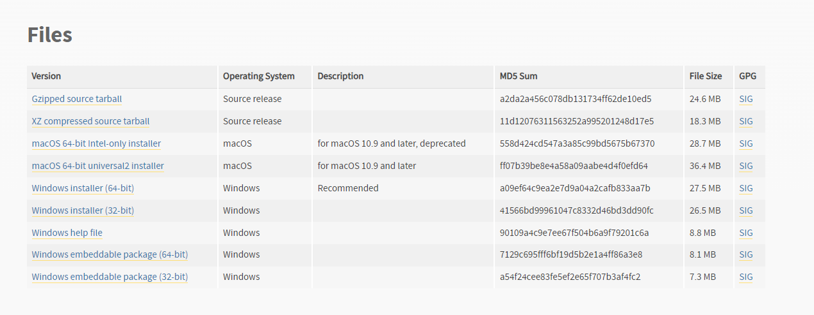
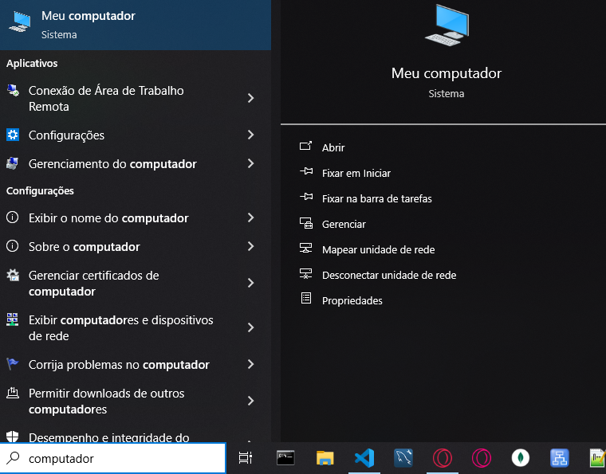
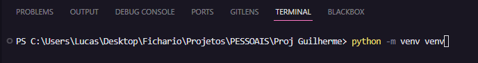
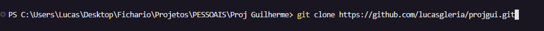

## 1. [Baixar](https://code.visualstudio.com/download) Visual Studio Code

#
## 2. Baixar [Python 3.9.9](https://www.python.org/downloads/release/python-399) e adicionar  ao caminho do sistema.

### Pesquise por Meu computador no Windows e vá em propriedades

### Vá em configurações avançadas do sistema na direita superior da tela

### Em propriedades do sistema, clique na aba "Avançado" e no último botão "Variáveis de ambiente"

### Em variáveis de ambiente clique em PATH e depois no botão "Editar"

### Em editar a variável de ambiente clique em "Novo" e adicione o path do Python 3.9.9 (ex: C:\Python39\Scripts)

#
## 3. Abrir o VSCode (com uma pasta vazia)
#
## 4. Criar Venv: Rodar no terminal: "python -m venv venv" (retire as aspas)
### Clique Cntrl + J para abrir o terminal
### Rode o comando no terminal

### Uma dessas duas pastas será criada (ou as duas)

### Não mexa nelas.
#
## 5. Rodar no terminal: "Git clone" (retire as aspas)
### Rode o comando no terminal: git clone https://github.com/lucasgleria/projgui.git

### Todo o projeto que está no github será clonado para seu respoitório local.
#
## 6. Instale as extensões no Visual Studio Code: Intellicode, Pylance, Pylint, Python, SQLite Viewer.
### Vá no Ícone de extensões da barra lateral esquerda e instale todas as extensões citadas acima

#
## 7. Rodar no terminal: "pip install pyserial PySimpleGUI sqlite3 PyPDF2 PdfReader pillow shutil uuid pymupdf pdf2image easyocr opencv-python opencv-python-headless cv2 tensorflow pytesseract threading fitz qimage2ndarray" (retire as aspas)
### Rode o comando no terminal

